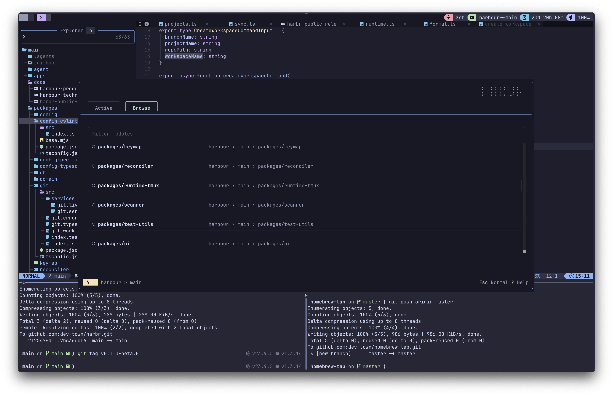
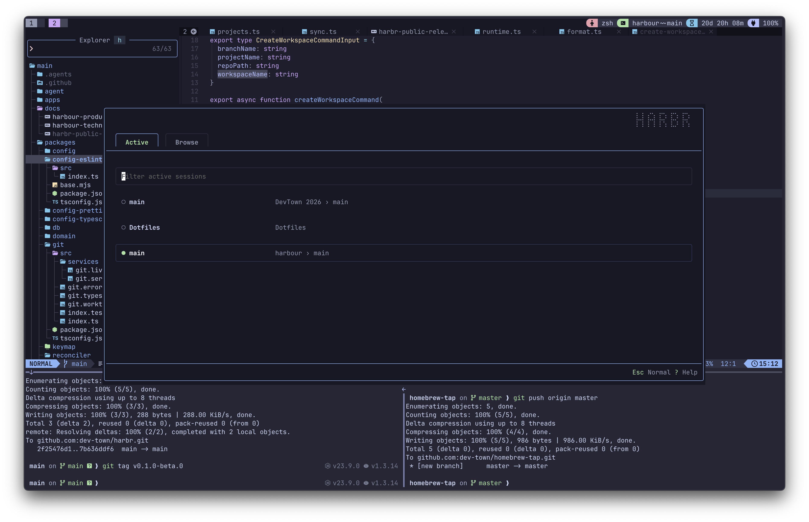
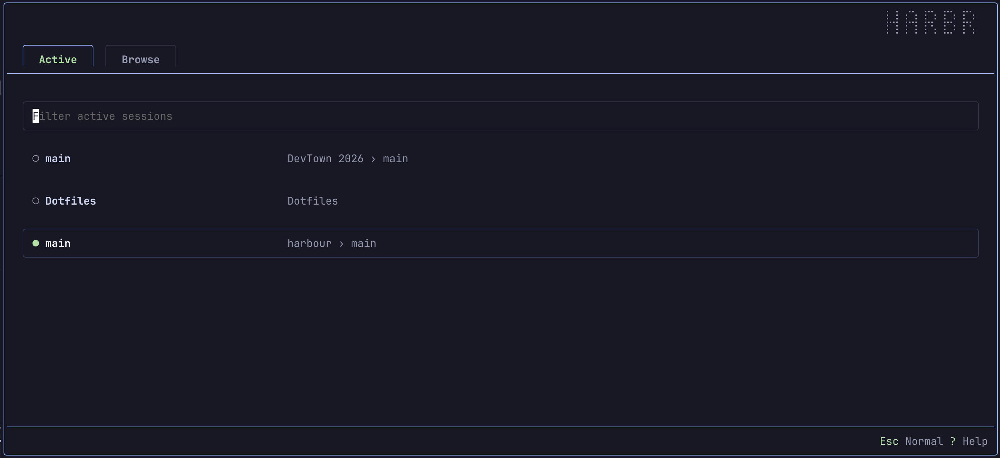

# Harbr

Harbr is a terminal-native workspace orchestrator for developers working with Git repositories, monorepos, worktrees, tmux sessions, and configured command layouts.

Harbr is not an IDE, terminal multiplexer, Git client, or AI coding tool. It is the control layer that understands development contexts and helps you create, navigate, restore, and jump into the right runtime.

Core model:

```text
Project -> Workspace -> Module -> Runtime
```

Git remains the source of truth for repository state. tmux remains the main local runtime. Harbr observes, reconciles, and coordinates them.

## Screenshots

Browse projects, workspaces, and modules from a tmux popup:



Switch between active Harbr runtimes:



Focused popup view:



## Current Status

Built today:

- TUI popover with Active and Browse tabs.
- Project -> workspace -> module drilldown.
- Config loading, validation, and normalization.
- Git/worktree scanning and module expansion.
- SQLite state and migrations.
- Reconciler flow from validated config intent, scanner facts, and runtime facts into the database.
- tmux session discovery, open/create, close, and configured window/pane creation.
- Workspace creation that creates Git worktrees.
- Configured window/pane layout loading into project, workspace, and module sessions.
- CLI sync entrypoint.

## Roadmap

- Durable events and OpenTelemetry export when product/debugging needs justify them.
- Richer local agent workflows built on configured tmux layouts.
- Remote sandbox or agent runtimes if the local runtime model proves out.

## Requirements

To run Harbr locally:

- macOS. Other Unix-like systems may work, but are not the current release target.
- Git with worktree support.
- tmux for local sessions and popup usage. If `display-popup -B` fails, remove `-B` from the binding.

To build from source or work on this repo:

- Bun `1.3.14`.

## Install

### Homebrew

Install with Homebrew:

```sh
brew install dev-town/tap/harbr
```

Or tap first:

```sh
brew tap dev-town/tap
brew install harbr
```

### From Source

Harbr uses Bun workspaces and Turborepo. From a checkout of this repo:

```sh
bun install
```

Build the single Harbr binary:

```sh
bun run build:tui
```

Build output:

- Binary: `apps/tui/dist/harbr`
- Headless sync: `apps/tui/dist/harbr sync`

## Run

Run the installed binary:

```sh
harbr
```

Run the source-built binary:

```sh
./apps/tui/dist/harbr
```

Run headless sync:

```sh
harbr sync
```

Run headless sync with JSON output:

```sh
harbr sync --json
```

Run with explicit config and database paths:

```sh
harbr --path ~/.config/harbr/config.json --db-path ~/.local/share/harbr/harbr.db
```

## Config

Default config path:

```text
~/.config/harbr/config.json
```

Default database path:

```text
~/.local/share/harbr/harbr.db
```

Example config:

```json
{
  "$schema": "https://raw.githubusercontent.com/dev-town/harbr/main/packages/config/harbr.schema.json",
  "projects": [
    {
      "name": "harbr",
      "repo": "~/Sites/harbr/harbr.git",
      "modules": [".", "apps/", "packages/"]
    },
    {
      "name": "myweddin",
      "repo": "~/Sites/myweddin/",
      "modules": [".", "apps/", "packages/"]
    },
    {
      "name": "DevTown 2026",
      "repo": "~/Sites/devtown-2026/devtown.git"
    },
    {
      "name": "Dotfiles",
      "repo": "~/.dotfiles/"
    }
  ],
  "windows": [
    {
      "name": "Agent",
      "panes": [
        {
          "name": "Opencode",
          "command": "opencode"
        },
        {
          "name": "CLI"
        }
      ]
    },
    {
      "name": "Editor",
      "panes": [
        {
          "name": "Neovim",
          "command": "nvim"
        },
        {
          "name": "CLI"
        }
      ]
    }
  ]
}
```

Config notes:

- `repo` may use `~` and is resolved to an absolute path.
- `repo` can point at a normal checkout or a bare Git directory.
- For bare repositories, Harbr discovers and creates worktrees from the Git directory.
- `modules` are repo-relative selectors.
- Use `.` for the repo root module.
- Use a trailing slash like `apps/` or `packages/` to expand child directories.
- Absolute module paths and `/` are rejected.
- `windows` define reusable tmux window/pane layouts.
- Loading a layout creates missing configured windows and panes in the target session.
- Existing configured windows are skipped, not duplicated.
- Project-level `windows` can reference global window names or define inline windows.
- A project can set `"windows": []` to disable global windows for that project.
- Pane `cwd` is optional and is resolved relative to the runtime cwd.
- Pane `command` may be a string or an array of strings.

## TUI Usage

The TUI starts on the Active tab when possible. It can restore context from the current tmux session, then falls back to saved UI context in the Harbr database.

Core keys:

- `Tab`: next tab.
- `Shift+Tab`: previous tab.
- `j` / `Down`: move down.
- `k` / `Up`: move up.
- `Ctrl+D` / `PageDown`: page down.
- `Ctrl+U` / `PageUp`: page up.
- `/` or `i`: focus search.
- `Esc`: clear search, go back, close modal, or close from the root list.
- `Enter`: select, drill down, switch session, or attach/create runtime depending on context.
- `Ctrl+F`: toggle Active/All visibility in Browse.
- `Ctrl+A`: open contextual actions.
- `Ctrl+R`: refresh projects and runtimes.
- `?`: show help.
- `Ctrl+C`: quit.

Common flows:

- Browse projects, workspaces, and modules from the Browse tab.
- Press `Enter` on a leaf context to open an existing tmux session or create one.
- Use the Active tab to switch between currently open Harbr tmux runtimes.
- Use `Ctrl+A` to open context actions such as open/start, workspace creation, or configured layout loading.
- Create a workspace to create a Git worktree, then open/start that workspace as a tmux session.
- Load configured layouts to create tmux windows and panes with optional startup commands.

## tmux Popup Setup

Harbr is designed to be launched inside a tmux popup.

Example tmux binding:

```tmux
bind-key -r H display-popup -B -E -d "#{pane_current_path}" -w 80% -h 60% -x C -y C "$HOME/bin/harbr"
```

Use any key you prefer. `prefix + p` is widely used by tmux users, so `prefix + H` or `prefix + S` is usually safer.

During local development, point the binding at the built binary:

```tmux
bind-key -r H display-popup -B -E -d "#{pane_current_path}" -w 80% -h 60% -x C -y C "<repo>/apps/tui/dist/harbr"
```

Option notes:

- `-B`: borderless popup. Requires a newer tmux version.
- `-E`: close the popup when Harbr exits.
- `-d "#{pane_current_path}"`: launch from the current pane directory.
- `-w 80% -h 60%`: popup width and height.
- `-x C -y C`: center the popup.

If your tmux does not support `-B`, remove it:

```tmux
bind-key -r H display-popup -E -d "#{pane_current_path}" -w 80% -h 60% -x C -y C "$HOME/bin/harbr"
```

## tmux Runtime Names

Harbr uses semantic tmux session names for created runtimes:

```text
project
project~~workspace
project~~workspace~~module
```

Examples:

```text
shop
shop~~feature-checkout
shop~~feature-checkout~~apps/web
```

Session segments escape tmux-dangerous characters such as `~`, `:`, `.`, and `%`. Existing tmux sessions without `~~` are treated as project-level sessions named after the tmux session.

## Repo Structure

```text
apps/
  tui/                 OpenTUI React app

packages/
  config/              config schema, loading, validation, normalization
  db/                  SQLite client, schema, migrations, project snapshots
  domain/              shared domain types
  git/                 Git repository and workspace inspection
  reconciler/          sync/reconcile services
  runtime-tmux/        tmux runtime adapter
  scanner/             project/workspace/module scanning
  test-utils/          shared test helpers

docs/                  product, architecture, and UX notes
```

## Working On The Repo

Install dependencies:

```sh
bun install
```

Start the TUI from source:

```sh
bun run --cwd apps/tui start
```

Run headless sync from source:

```sh
bun run --cwd apps/tui start -- sync
```

Build everything:

```sh
bun run build
```

Build the TUI binary:

```sh
bun run build:tui
```

### Release Notes

Harbr uses Changesets for release notes and version bumps. Feature, fix, and security PRs should include a changeset:

```sh
bun changeset
```

For user-facing binary changes, select `@harbr/tui`. While Harbr is in beta, Changesets prerelease mode keeps those Version Packages PRs on the `-beta.N` line. After changesets land on `main`, GitHub Actions opens or updates a `Version Packages` PR that updates package versions and changelogs. Merge that version PR when ready to release, then tag the resulting `main` commit.

Run checks:

```sh
bun run check
```

Individual checks:

```sh
bun run lint
bun run test
bun run typecheck
bun run format:check
```

### Database Migrations

When changing `packages/db/src/schema.ts`, generate Drizzle SQL first, then generate Harbour's compiled-binary-safe migration wrappers:

```sh
bun run --cwd packages/db db:generate -- --name your_migration_name
bun run --cwd packages/db db:migration
bun run check:migrations
```

Commit both the Drizzle output and generated wrappers:

```text
packages/db/drizzle/**
packages/db/src/migrations/**
packages/db/src/migrations.gen.ts
```

`db:generate` updates Drizzle SQL and journal files. `db:migration` converts those SQL migrations into TypeScript modules embedded in the compiled TUI/CLI binaries.

### Effect Runtime Shape

Harbr packages expose Effect service tags, API types, and live layers. Packages should not export convenience helper functions that secretly provide live implementations.

Runtime choices such as config and database paths are represented as option services:

```text
ConfigServiceOptions -> ConfigServiceLive
DatabaseClientOptions -> DatabaseClientLive -> ProjectServiceLive
```

`apps/tui` composes package live layers and option layers into one app layer, then creates one shared Effect runtime when the interactive TUI launches. TUI actions and data helpers run programs through that shared runtime and request services explicitly:

```ts
Effect.gen(function* () {
  const runtimeTmux = yield* RuntimeTmuxService

  return yield* runtimeTmux.openOrCreateRuntime(target)
})
```

One-shot commands such as `harbr sync` create an app runtime for the command and dispose it after rendering output.

Format:

```sh
bun run format
```
