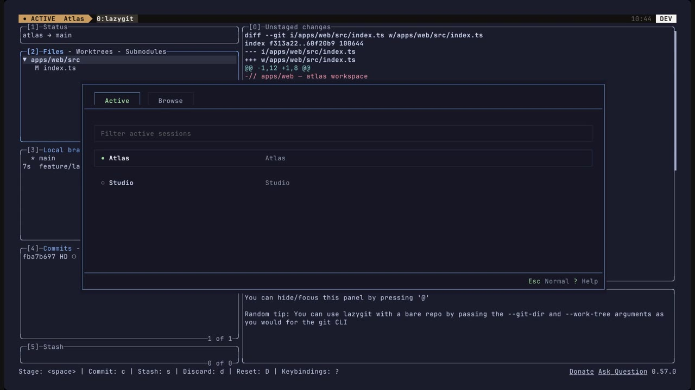

# Harbr

Harbr brings your Git projects, worktrees, modules, and terminal sessions into one place. Browse a project, create a workspace, open its runtime, or jump back to a session you already have running.

A project is a Git repository. Its workspaces are Git worktrees; modules are directories within them. A tmux session or Herdr workspace is the runtime you can open for any of those contexts.

## Requirements

- macOS or Linux on x64 or ARM64.
- Git with worktree support.
- tmux with `display-popup`, or [Herdr](https://herdr.dev/) 0.8.2 or newer for the Harbr plugin.

## Install

Choose one method:

```sh
# Installs the latest stable release to ~/.local/bin
curl -fsSL https://dev-town.com/labs/harbr/install.sh | sh
```

```sh
# Installs through the DevTown Homebrew tap
brew install dev-town/tap/harbr
```

Check the installation with `harbr --version`. If you used the curl installer and your shell cannot find `harbr`, add its directory to your `PATH` (and to your shell startup file to keep it there):

```sh
export PATH="$HOME/.local/bin:$PATH"
```

The installer verifies the release archive against its published SHA-256 checksum.

To update later, rerun the curl installer or use `brew update && brew upgrade dev-town/tap/harbr` for Homebrew.

## Configure Harbr

Harbr needs a JSON config file at `~/.config/harbr/config.json` before it can load your projects. Create that directory and save a config like this:

```sh
mkdir -p ~/.config/harbr
```

```json
{
  "$schema": "https://dev-town.com/labs/harbr/harbr.schema.json",
  "projects": [
    {
      "name": "harbr",
      "repo": "~/Projects/harbr",
      "modules": [".", "apps/", "packages/"]
    },
    {
      "name": "Atlas",
      "repo": "~/Projects/atlas",
      "modules": [".", "apps/"]
    },
    {
      "name": "Studio",
      "repo": "~/Projects/studio"
    }
  ],
  "windows": [
    {
      "name": "Editor",
      "panes": [{ "name": "Neovim", "command": "nvim" }, { "name": "Shell" }]
    }
  ]
}
```

Replace the example `repo` paths with Git repositories that exist on your machine, and remove projects you do not use. Harbr reports an error for a missing repo path.

- `$schema` gives your editor validation and completion.
- `repo` accepts `~` and can point to a checkout or bare Git directory.
- `modules` are optional: `.` selects the repo root, while `apps/` expands its immediate child directories.
- `windows` defines a reusable layout for tmux windows and panes or Herdr tabs and panes. Load it from Harbr's context actions. The example uses Neovim, so edit or remove that command if you do not use it.

### Open Harbr in a tmux popup

Add a binding to `~/.tmux.conf`:

```tmux
bind-key -r H display-popup -E -d "#{pane_current_path}" -w 80% -h 60% -x C -y C "$HOME/.local/bin/harbr"
```

Reload tmux with `tmux source-file ~/.tmux.conf`, then press your tmux prefix followed by `H`. This path matches the curl installer's default. For Homebrew or a custom install directory, replace `$HOME/.local/bin/harbr` with the path shown by `command -v harbr`. The popup opens in the current pane's directory and closes when you exit Harbr.

### Open Harbr in a Herdr popup

Install the [Herdr plugin](herdr-plugin/README.md):

```sh
herdr plugin install dev-town/harbr/herdr-plugin
```

Add its keybinding to `~/.config/herdr/config.toml`:

```toml
[[keys.command]]
key = "prefix+shift+h"
type = "plugin_action"
command = "dev-town.harbr.open"
description = "Open Harbr"
```

Run `herdr server reload-config`, then use `prefix+shift+h`. The plugin needs `harbr` on the `PATH` inherited by Herdr. Choose another key if that binding is already in use. The [plugin guide](herdr-plugin/README.md) includes install and troubleshooting details.

You can also run `harbr` directly in a terminal after saving the config.

## Features

- Browse configured projects, Git worktrees, and modules from the Browse tab.
- See active tmux sessions or Herdr workspaces and switch to one from the Active tab.
- Create a Git worktree from Harbr, then open its runtime.
- Open or create a runtime for a project, workspace, or module.
- Load configured layouts as tmux windows and panes or Herdr tabs and panes, including optional startup commands.
- Search lists, use contextual actions, and open keyboard help without leaving the TUI.

## See Harbr in action

Watch a one-minute walkthrough of session switching, monorepo navigation, layouts, and keyboard help.

[](docs/assets/readme/harbr-walkthrough.mp4)

[Watch the walkthrough with audio (MP4)](docs/assets/readme/harbr-walkthrough.mp4)

## Basic controls

- `Tab` / `Shift+Tab`: switch between Active and Browse.
- `j` / `k` or arrow keys: move through lists.
- `Enter`: select a context, open a runtime, or switch sessions.
- `Ctrl+A`: open context actions, including workspace creation and layout loading.
- `/` or `i`: search; `Esc`: clear search, go back, or close a modal.
- `Ctrl+R`: refresh; `?`: show all keys; `Ctrl+C`: quit.

Harbr stores local metadata in `~/.local/share/harbr/harbr.db`. Use `harbr --path <config>` or `harbr --db-path <database>` to override the defaults. Run `harbr sync` to refresh configured projects without opening the TUI; add `--json` for machine-readable output.

For building, testing, and contributing, see [CONTRIBUTING.md](CONTRIBUTING.md). Maintainers can find the release process in [docs/releasing.md](docs/releasing.md).
